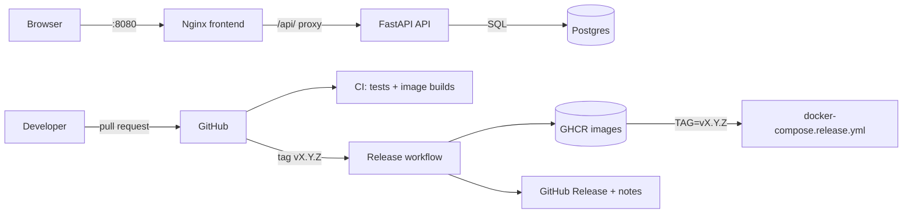

# Taskboard architecture

- `main` is protected: changes arrive by pull request, and `test` and `build` must pass.
- Releases are immutable version tags. Rolling back means redeploying an older tag.
